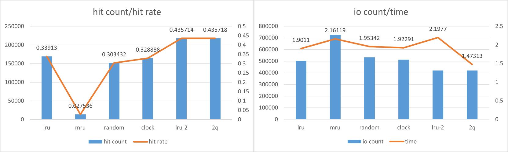

# Storage and Buffer Manager

SA23011149 曹一帆

## 实验设计

Storage and Buffer Manager 的主要部分是 `DataStorageManager` 和 `BufferManager`, 具体结构如下图, 以下是每种结构的功能:
1. `DataStorageManager` 提供文件的访问, 实现对文件的 page 的读写功能.
2. `BufferManager` 提供缓冲区的支持, 缓冲区可以使用不同的替换算法如 LRU, MRU, RANDOM, CLOCK, LRU-2 和 2Q.
3. `BufferManager` 的不同替换算法由 `Replacer` 实现


## 实现结果

#### `DataStorageManager` 的实现

`DataStorageManager` 用于文件的读写, 其成员函数具体实现为:
- `open_file` 打开文件并查询文件的长度, 从而获取 page 数量、page 的 use_bit 等信息
- `close_file` 关闭文件
- `read_page` 从文件的指定 page 读取内容
- `write_page` 将内容写入文件的指定 page
- `inc_num_pages` 将文件增大一个 page
- `set_use/get_use` 设置/获取指定 page 的 use_bit

#### `BufferManager` 的实现

缓冲区中 frame 的数量由 `DEFBUFSIZE` 定义, 所有缓冲区在内存中连续存储, 缓冲区控制块的定义如下:
```c
struct BCB
{
    int page_id; // page id
    int frame_id; // frame id
    int latch; // 乐观内存锁, 本实验未使用
    int count; // 此 frame 当前的用户数
    int dirty; // 如果进行了写操作, dirty 设为 1
    BCB *next; // 在哈希表的桶内有多个 BCB 用单向链表连接
    // 以下为替换算法使用
    BCB *algo_next; // 双向链表
    BCB *algo_prev; // 双向链表
    union {
        int time[2]; // LRU-2 使用的时间(用访问次数当作时间), 0 为倒数第 1 次, 1 为倒数第 2 次
        int referenced; // CLOCK 使用
        int access_times; // 2Q 使用, 访问过 0 次, 1 次 或 2 次
    };
};
```
`BufferManager` 成员函数的实现为:
- `fix_page` 将 page_id 转为 frame_id, 若缓冲区内没有, 则分配新的缓冲区或使用替换算法替换
- `fix_new_page` 在文件中创建新 page, 并将 page 放入缓冲区, 返回 frame_id
- `unfix_page` 用户释放指定 page, BCB 的 count 要递减
- `select_victim` 分配新的缓冲区, 如果没有未分配的 frame, 则调用 `replacer->select_victim()` 得到被选中进行替换的 frame, 替换时若 dirty 为 1, 要重新写入磁盘
- `hash` 将 page_id 转为哈希表的 key 的哈希算法
- `set_dirty/unset_dirty` 设置 dirty 位
- `write_dirtys` 将所有 dirty 的 page 写入磁盘

#### 不同替换算法的实现

- `LruReplacer` 使用一个双向链表, 每当某个 frame 被访问, 则将其 BCB 放入队尾, 进行替换时, 队头被选中
- `MruReplacer` 同 `LruReplacer`, 只是在替换时, 队尾被选中
- `RandomReplacer` 任何访问对算法无影响, 在替换时随机选择一个 frame 进行替换
- `ClockReplacer` 将所有 frame 排成环, 每当 frame 被访问时, 它的 BCB 的 referenced 置为 1. 进行替换时, 从 current 开始找, 直到找到 count 为 0 且 referenced 为 0 的进行替换, 而寻找过程中的 referenced 为 1 的会被置为 0, 以给其第二次机会
- `Lru2Replacer` 构造两个队列, 一个 lru 队列储存只访问过 1 次的, 一个按照倒数第 2 次访问时间排序的队列储存访问多余 1 次的. 进行替换时, 首先尝试替换 lru 队列中的, 如果没有, 则替换另一队列中最早的(即队头).
- `TwoQueueReplacer` 构造两个队列, 所有只访问过 1 次的位于 FIFO 队列, 多于 1 次的位于 lru 队列. 进行替换时, 首先尝试选择 fifo 的队头, 否则选择 lru 的队头.

## 运行结果

实验统计了访问总次数、命中次数、命中率、磁盘 I/O 次数以及执行时间, 具体如下表及下图所示. 从图表中可以看出:
1. 在 hit rate 上, LRU-2 与 2Q 表现最好, 接着 LRU, CLOCK, RANDOM 逐个递减, 彼此相差不大但明显低于 LRU-2 与 2Q, MRU 最差, LRU-2 与 2Q 的表现说明了考虑了访问频率的算法具有明显的作用
2. 在 io count 即磁盘 I/O 次数上, 规律与 hit rate 是一致的, hit rate 越高, I/O 次数越少
3. 在 time 即执行时间上规律与 hit rate 也几乎一致, 但有个特例是 LRU-2 的执行时间要长, 甚至达到了所有的算法中最长的, 这是因为 LRU-2 中访问次数超过 2 的所在队列需要在每次进行访问时, 都要重新安插到合适的地方以使得队列有序, 从而导致执行时间反而变长了


||access count|hit count|hit rate|io count|time|
|:-:|:-:|:-:|:-:|:-:|:-:|
|LRU|500000|169565|0.33913|502821|1.9011s|
|MRU|500000|13768|0.027536|727036|2.16119s|
|RANDOM|500000|151716|0.303432|533074|1.95342s|
|CLOCK|500000|164444|0.328888|511780|1.92291s|
|LRU-2|500000|217857|0.435714|419835|2.1977s|
|2Q|500000|217859|0.435718|419832|1.47313s|



